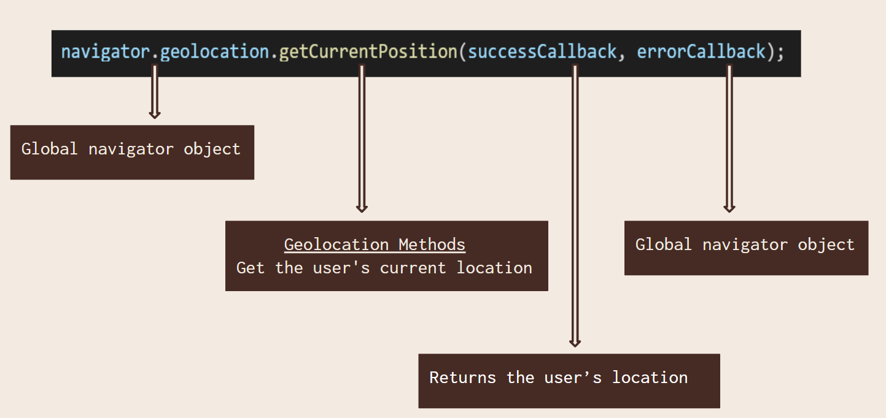

The ☞<span style="color:#241977; font-weight: bold; font-size: 20px">Geolocation API</span>☜ helps websites find a user's location with their permission. It is often used in navigation, maps and location-based services. 🚗📍

In simple words, **HTML5 Geolocation** is a browser API that is used for getting the device geographic position in the form of *latitude*, *longitude* and *accuracy coordinates*. This can help detect the *geolocation* of the visitor or user on a website or app.  

**SYNTAX**  
```
{
navigator.geolocation.getCurrentPosition(successCallback, errorCallback)  
}
```  

[](https://docs.google.com/presentation/d/1UmDCmZp-3H1diTsSvLT-ouOn7y1ZxxZH/edit?usp=sharing&ouid=105855424332128977916&rtpof=true&sd=true)

---

**👉 Geolocation Methods:**

| Method              | Description |
|:-------------------:|:-----------------------------------------------:|
| getCurrentPosition()|Retrieve current geographic location website user|
| watchPosition()     |Update the user's live location continuously     |
|clearWatch()         |Clear the ongoing watch of the user's location   |


- **How does it work**❓🤔💭
    1. Uses *GPS, Wi-Fi & IP address* to get the location
    2. Always returns latitude, longitude and accuracy properties
    3. Other properties are returned if available
    4. Asks for user permission for privacy and security reasons

- **Handling Success Response**  

🎉 ***Success:*** Returns position object containing latitude & longitude

```
function showPosition(position){  
       var x = `Your current location is (Latitude: ${position.coords.latitude}, Longtitude: ${position.coords.longitude})`;
       document.getElementById("location").innerHTML = x;  
     }  
```

- **Handling Errors**  

⚠️***Error:*** Handles problems like permission denied or timeout

```
     function showError(error) {  
        switch(error.code){  
            case error.PERMISSION_DENIED:  
            alert("User denied the request for Geolocation API.");  
            break;  
        case error.POSITION_UNAVAILABLE:  
            alert("USer location information is unavailable.");  
            break;  
        case error.TIMEOUT:  
            alert("The request to get user location timed out.");  
            break;  
        case error.UNKNOWN_ERROR:  
            alert("An unknown error occurred.");  
            break;  
    }  
        }  
```

---

***COMPLETE EXAMPLE OF GEOLOCATION API***
```
<!DOCTYPE html>  
<html>  
<head>  
<title>Geolocation API</title>  
</head>  
<body>  
  <h1>Find your Current location</h1>  
<button onclick="getlocation()">Click me</button>  
<div id="location"></div>  
<script>  
    var x= document.getElementById("location");  
    function getlocation() {  
        if(navigator.geolocation){  
            navigator.geolocation.getCurrentPosition(showPosition, showError)  
          }  
        else  
        {  
             alert("Sorry! your browser is not supporting")  
         } }  
       
     function showPosition(position){  
       var x = `Your current location is (Latitude: ${position.coords.latitude}, Longtitude: ${position.coords.longitude})`;
       document.getElementById("location").innerHTML = x;  
     }  

     function showError(error) {  
        switch(error.code){  
            case error.PERMISSION_DENIED:  
            alert("User denied the request for Geolocation API.");  
            break;  
        case error.POSITION_UNAVAILABLE:  
            alert("USer location information is unavailable.");  
            break;  
        case error.TIMEOUT:  
            alert("The request to get user location timed out.");  
            break;  
        case error.UNKNOWN_ERROR:  
            alert("An unknown error occurred.");  
            break;  
    }  
        }  

</script>  
</body>  
</html>  
```

---

- **Where is it used?**
  1. 🗺️ Google Maps & Navigation Apps
  2. 🍕 Food delivery & Ride-sharing apps
  3. 🌤️ Weather apps that show location-based updates
  4. 🔒 Security & Tracking systems

- 🛡️ **Privacy Considerations:**
  - 📞 Always ask for user permission before using location
  - 🤝🏻 Do not store or share location data without consent

> :bulb: **Tip:** Always handle user consent and fallback options when using a Geolocation API to ensure a seamless experience!🌍ᯓ➤

---

> I've created [Technical Presentation](https://docs.google.com/presentation/d/1UmDCmZp-3H1diTsSvLT-ouOn7y1ZxxZH/edit?usp=sharing&ouid=105855424332128977916&rtpof=true&sd=true) on this topic. You can refer to it, along with the slide notes for a better understanding.
>
>> **ABOUT ME:** 👧🏽 I'm Frontend Developer based in Stockholm, Sweden, currently working at SITA.dev. My transition into tech has been a unique and rewarding adventure, fueled by curiosity and determination. You can connect with me on [LinkedIn](https://www.linkedin.com/in/himanayk/)

---

The ☞**<span style="color:#2a28be; font-size: 20px">Geolocation API</span>**☜ helps